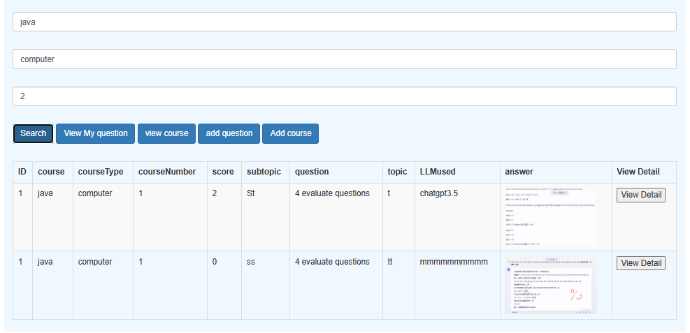
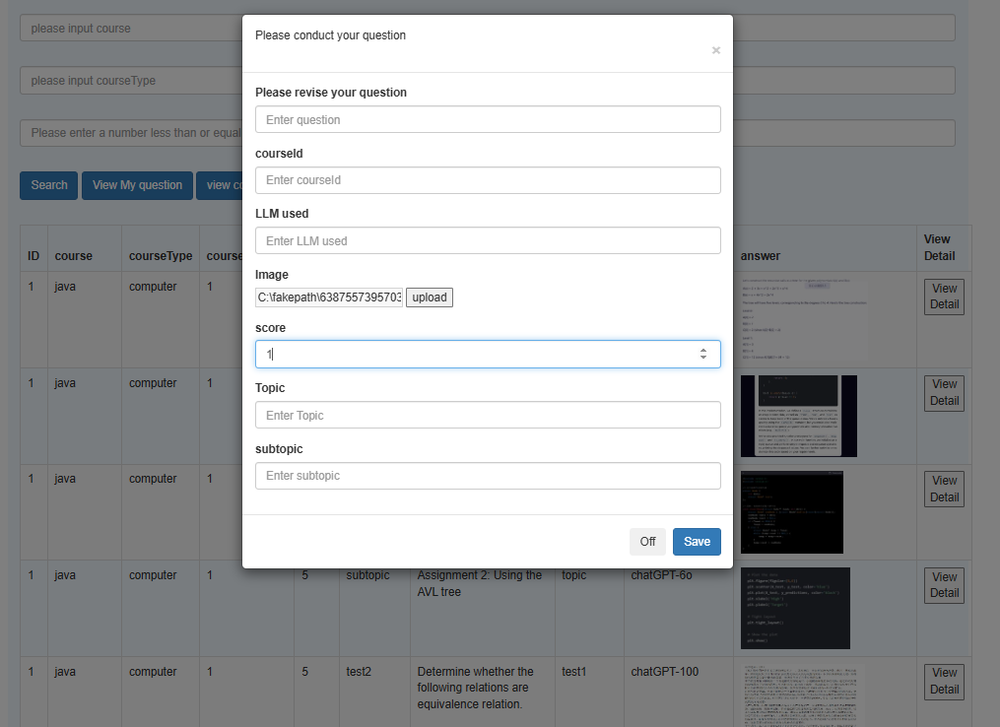
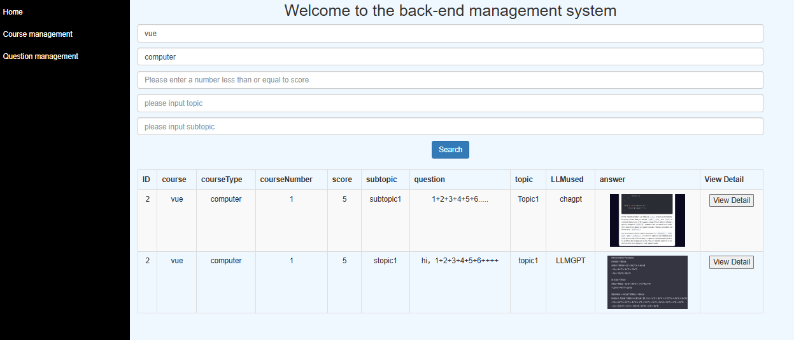
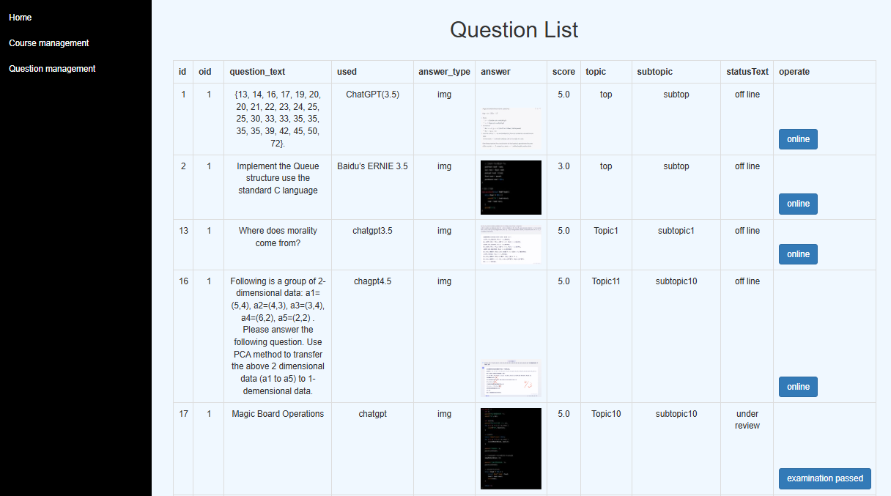
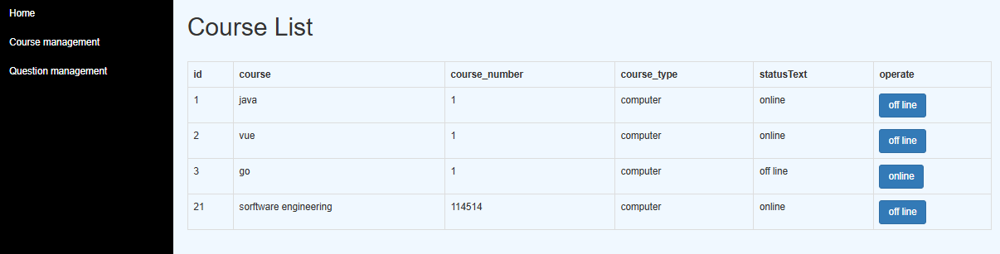
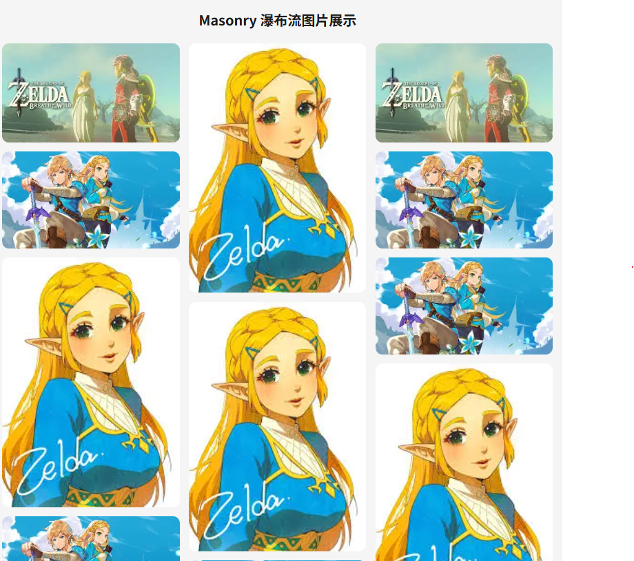
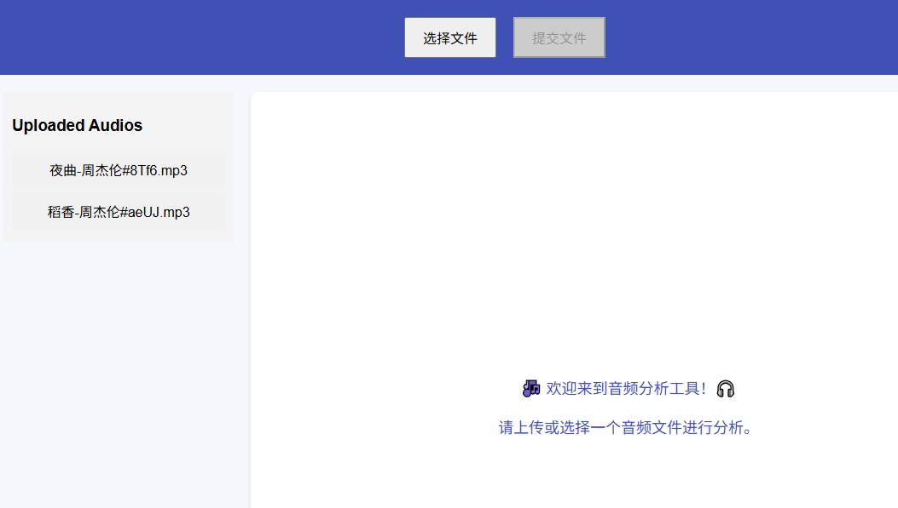
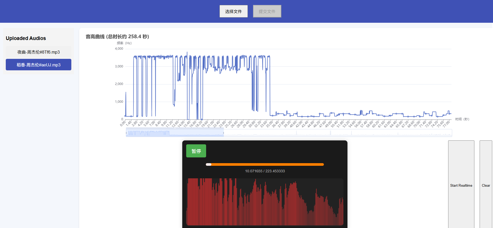
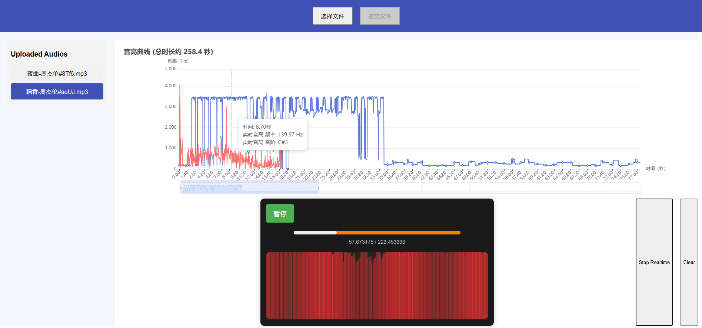
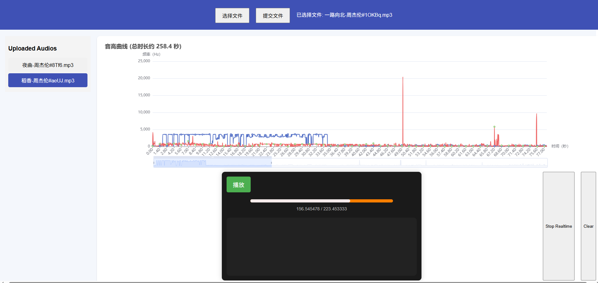

# 🚀 WorkshopCenter 项目总览

> 📌 **说明：不定期更新**

---

## 💎 饰品交易平台

- **技术栈**：HTML, CSS, JavaScript, jQuery, Ajax, MySQL  

**示意图：**  

  
  
  

---

## 🔍 llm_code

- **技术栈**：Python, Flask, MySQL  

**示意图：**  

  
  
  
  
  
  

---

## 🧠 NextJs_Workshop

- **技术栈**：JavaScript, Next.js, React, Node.js, MySQL, Express

**示意图：**  

  
  
  
  
  

---

## 🎧 MyAudioApp

- **技术栈**：JavaScript, Web Audio API, Vue.js, FastAPI  

- **核心功能：**
  - 音频切片上传与播放  
  - 实时人声音高与原曲比对反馈  
  - 波形图与音高走势的动态可视化

**示意图：**  

  
  
  
  
  
  

---

## 📱 MobileComputing

- **技术栈**：C++, Qt, WebSocket, MySQL  
- **简介**：使用 Qt 编写的本地聊天应用，结合 WebSocket 实现局域网实时通信与数据库记录功能。
