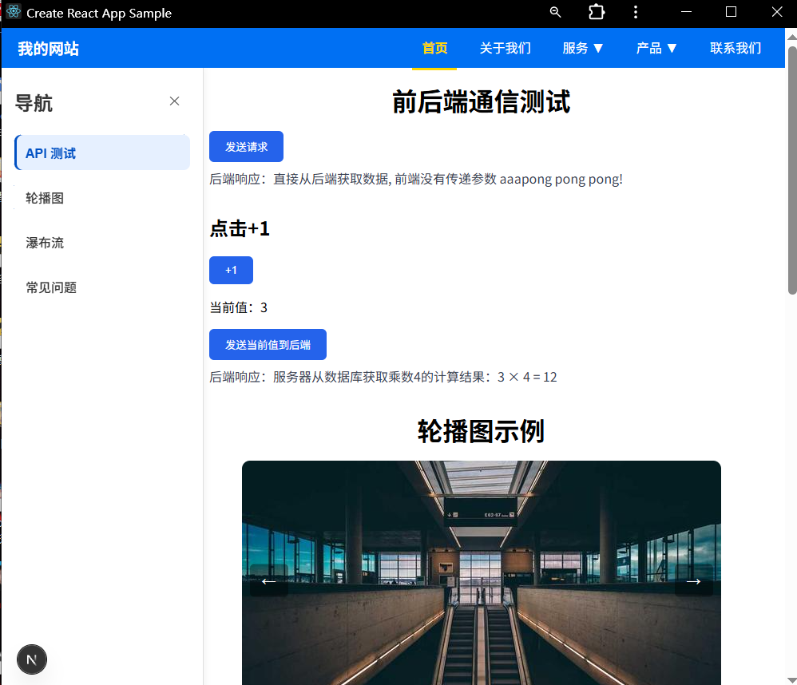
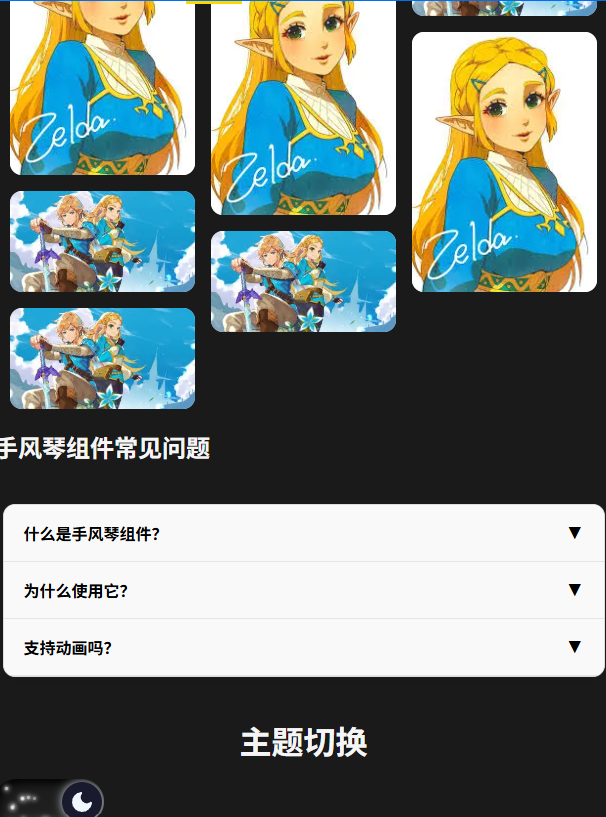
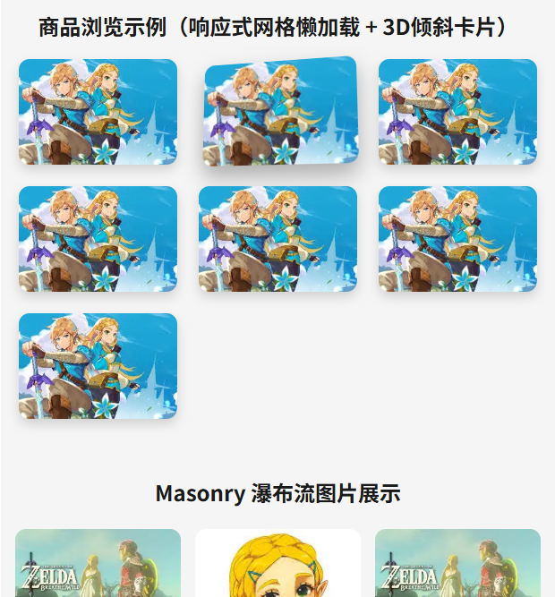
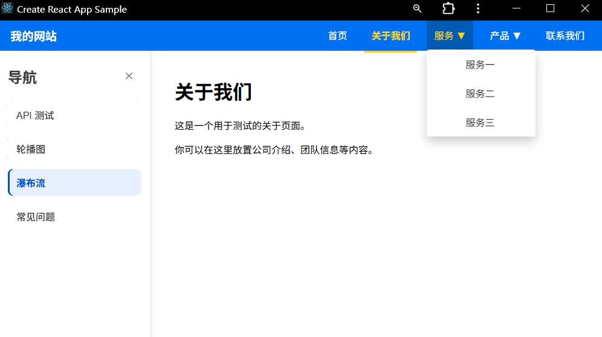
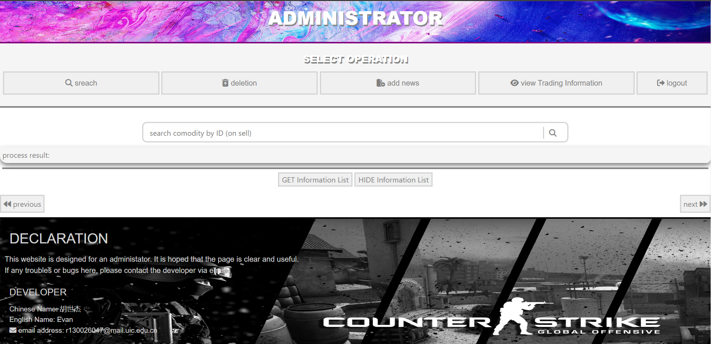
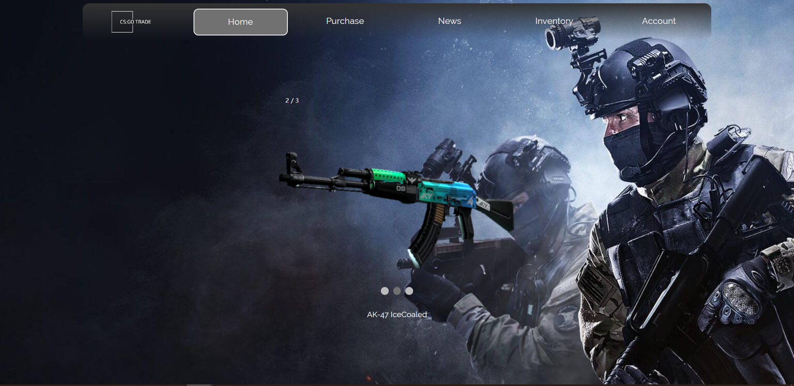
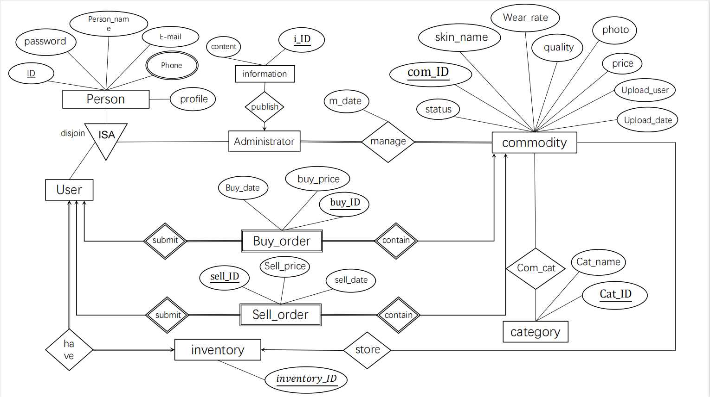

# WorkshopCenter 项目总览

> **说明：不定期更新**

## JavaBackEndPractice
Java Spring Boot 后端练习项目，涵盖了基础的RESTful接口设计、数据库操作及安全配置。  
适合学习后端核心技术和框架应用。

> 示例功能：
- 用户管理接口
- 权限验证
- 数据库持久化

---

## llm_code
基于 Flask 的轻量级 Web 应用，涉及后端路由和前端页面渲染。  
适合Python后端快速开发练习。

> 示例功能：
- Flask路由设计
- 前后端模板交互
- 静态资源管理

---

## mobileComputing
基于 Qt 的简易聊天程序，采用 WebSocket 实现实时消息通信。  
适合学习跨平台桌面应用开发及网络通信。

> 示例功能：
- 界面设计（Qt Widgets）
- 实时消息收发
- 基础网络协议

---

## NextJs_Workshop
Next.js 全栈练习项目，实现服务器端渲染（SSR）和前后端数据交互。  
适合前端框架和全栈开发入门。

> 示例功能：

示意图：  

  
  
  
  

---

## 饰品交易

传统前端网页项目，使用 HTML、CSS、JavaScript，结合 jQuery 和 Ajax 实现动态效果。  
适合网页静态与动态交互的学习。

> 示例功能：

示意图：

  
  
  

---

## MyAudioApp
这是一个音频处理应用，提供音高对比、实时音频录制和可视化等功能。  
适合学习音频分析和前端实时数据可视化。

> 示例功能：
- 音频切片上传和播放
- 实时音高比较与反馈
- 可视化音频波形图和音高走势

示意图：  

  
  
  
  
  
  

