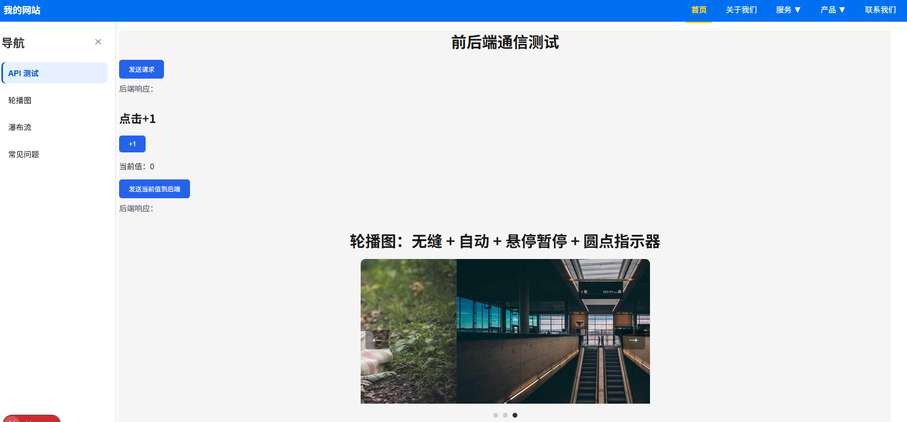
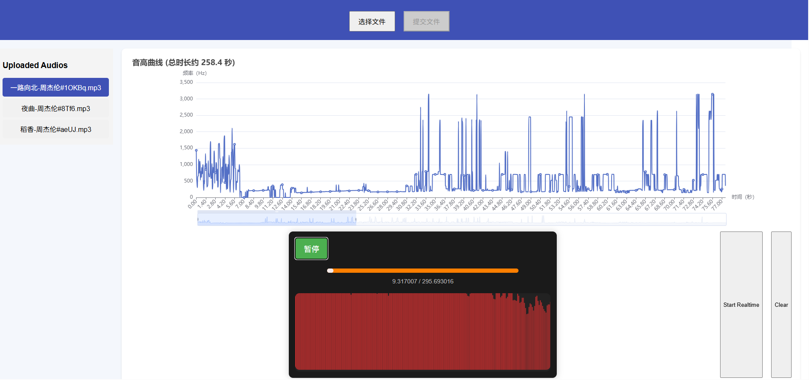

# WorkshopCenter 项目总览

> **说明：不定期更新**

## NextJs_Workshop
技术栈：JavaScript, Next.js, React, Node.js

示意图：  

  
  
  
  

---

## 饰品交易
技术栈：HTML, CSS, JavaScript, jQuery, Ajax  

示意图：

  
  
  

---

## MyAudioApp
技术栈：JavaScript, Web Audio API, Vue.js, FastAPI  

> 功能：
- 音频切片上传和播放
- 实时音高比较与反馈
- 可视化音频波形图和音高走势

示意图：  

  
  
  
  
  
  

---

## llm_code
技术栈：Python, Flask

---

## mobileComputing
技术栈：C++, Qt, WebSocket  
Qt做的简单聊天，WebSocket 实现实时消息通信。

> 示例功能：
- 界面设计（Qt Widgets）
- 实时消息收发
- 基础网络协议
